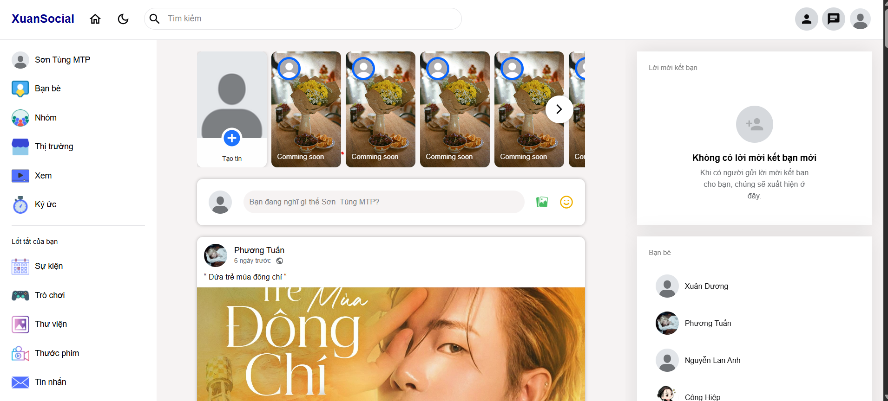
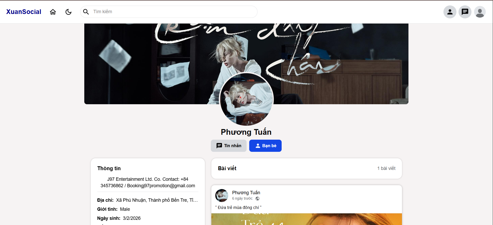
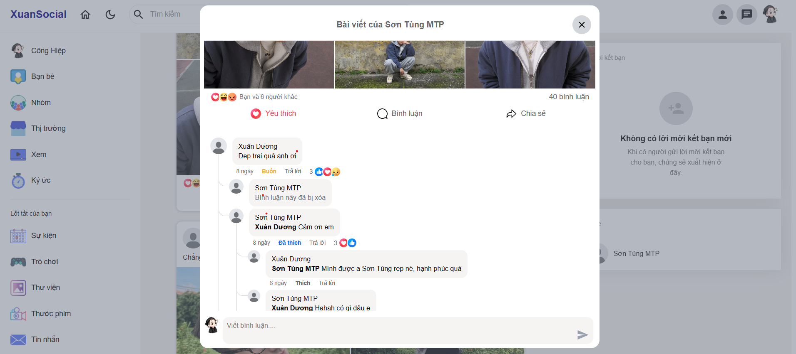
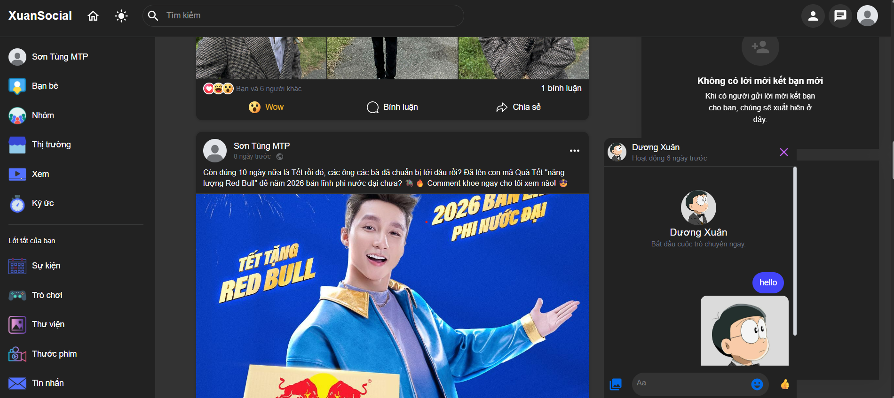
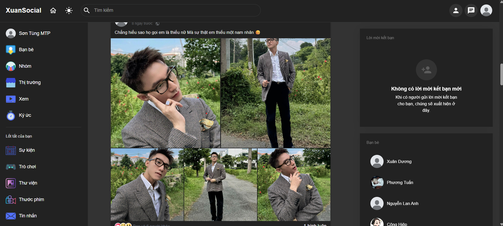

# Mini-Social - Fullstack Networking Platform

**Mini-Social** là một nền tảng mạng xã hội thu nhỏ nhưng đầy đủ sức mạnh, kết nối người dùng thông qua trải nghiệm tương tác thời gian thực (Realtime), quản lý nội dung đa phương tiện và hệ thống bảo mật chặt chẽ.

---

## ✨ Tính năng nổi bật

### 📝 1. Bảng tin & Bài viết (Feed & Posts)

- **Đăng bài (Create Post):** Hỗ trợ chia sẻ trạng thái kèm hình ảnh.
- **Quản lý nội dung:** Cho phép **Sửa** và **Xóa** bài viết cá nhân linh hoạt.
- **Hệ thống cảm xúc (Reactions):** Tương tác đa dạng với các icon:
  - 👍 Like
  - ❤️ Love
  - 😂 Haha
  - 😮 Wow
  - 😢 Sad
  - 😡 Angry

---

### 💬 2. Bình luận & Trao đổi (Comments)

- **Nested Comments:** Bình luận lồng nhau nhiều cấp (Reply), giúp theo dõi cuộc hội thoại một cách logic.
- **Realtime Chat:** Nhắn tin tức thời với bạn bè qua kết nối **Socket.io**.

---

### 🤝 3. Kết nối & Tìm kiếm (Social Network)

- **Kết bạn:** Gửi lời mời, chấp nhận hoặc hủy kết bạn.
- **Tìm kiếm thông minh:** Tìm người dùng theo Tên/Username hỗ trợ cả Tiếng Việt có dấu và không dấu.
- **Trang cá nhân:** Tùy chỉnh thông tin cá nhân (Ảnh đại diện, Ngày sinh, Số điện thoại, Địa chỉ...).

---

### 🌓 4. Trải nghiệm người dùng (UX/UI)

- **Darkmode:** Chế độ tối giúp bảo vệ mắt và tiết kiệm pin.
- **Xác thực (Auth):** Hệ thống Đăng ký/Đăng nhập bảo mật với **JWT (JSON Web Token)**.
- **Responsive:** Giao diện co giãn hoàn hảo trên mọi kích thước màn hình.

---

## 🛠 Công nghệ sử dụng (Tech Stack)

| Phân loại       | Công nghệ                                   |
| --------------- | ------------------------------------------- |
| **Frontend**    | React.js, Tailwind CSS, Redux / Context API |
| **Backend**     | Node.js, Express.js, Zod (Validation)       |
| **Database**    | MongoDB, Mongoose                           |
| **Realtime**    | Socket.io                                   |
| **Lưu trữ ảnh** | Cloudinary                                  |

---

## 🔧 Giải pháp kỹ thuật tiêu biểu

### ✅ Validation thông minh với Zod

### 🔍 Thuật toán Tìm kiếm (Smart Search)

Áp dụng **Smart Regex** để chuẩn hóa tiếng Việt, giúp người dùng tìm thấy kết quả chính xác dù gõ có dấu hay không dấu mà không cần cấu hình Database phức tạp.

### 📞 Đồng bộ hóa Phone Input

Xử lý logic `value` và `dialCode` để tránh hiện tượng "khóa input" hoặc nhảy con trỏ chuột khi người dùng chỉnh sửa số điện thoại quốc tế.

---

## 📸 Demo hình ảnh

- 🏠 Trang chủ & Newsfeed
  
- 🧑‍💼 Trang cá nhân
  
- 💬 Bình luận phân cấp
  
- 💬 Chat
  
- 🌙 Chế độ Darkmode
  

---

## 🙏 Thank You

Cảm ơn bạn đã dành thời gian ghé thăm và xem qua dự án này.

Nếu bạn thấy Mini-Social hữu ích hoặc thú vị, mình rất trân trọng nếu bạn có thể dành tặng một ⭐ trên GitHub để ủng hộ và tạo thêm động lực phát triển dự án.

Sự ủng hộ của bạn là nguồn động lực lớn nhất để mình tiếp tục cải thiện và xây dựng những sản phẩm tốt hơn nữa 🚀
